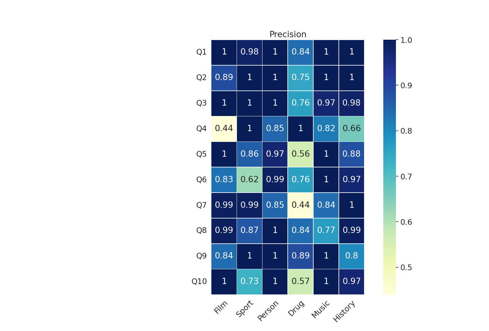
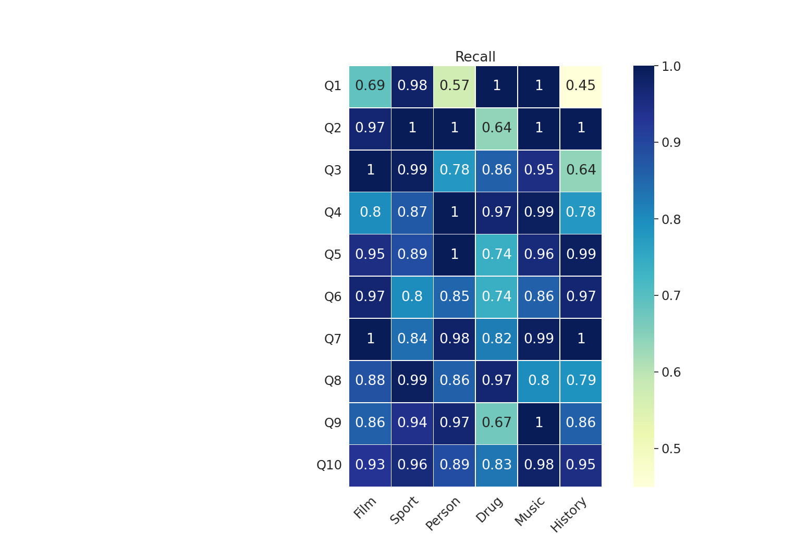

## SAP-KG: Synonym Predicate Analyzer across Multiple Knowledge Graphs

In community-maintained knowledge graphs contain millions of facts, contributors can introduce new predicates that have similar meanings to other predicates in the KG, known as synonym predicates. We present SAP-KG, a knowledge graph-agnostic approach, to illustrate the benefits of identifying these synonym predicates that provide complementary information and using them in rewriting SPARQL queries to retrieve the complete result. SAP-KG proposed a metric to compute the percentage of overlap between pairs of synonym predicate candidates and capture the most similar predicates which can complement each other. Additionally, we present a query processing technique that put in perspective the role of synonym predicates in query answer completeness.

We validate our tool by computing the accuracy (precision and recall values). Accuracy refers to how complete is the result of rewritten queries by SAP-KG. Ten queries over six domains (e.g., Film, Sport, Person, Drug, Music, History) that return incomplete results are selected. By rewriting these queries with the synonym predicates which complement each other, the complete answers are retrieved. The high value of precision shows the completeness of query answer after rewriting with synonym predicates compared with the queries without rewriting with synonym ones.

  
   

## Demonstration
The Jupyter notebook (`SAP-KG.ipynb`) in this repository contains a demonstration of SAP-KG. First synonym predicates are detected by computing the overlap between synonym candidates to select the ones with lower overlap. The low overlap between synonym predicate candidates shows that the predicates can complement each other. Therefore, for query answer completeness they are used in query rewriting. The SPARQL query used in the demonstration returns the children, cause of death, place of birth, and parent for any resources. Moreover, we illustrate the precision-recall to show the accuracy of the tool.  

## Getting Started
To run the demo, click on the Binder badge above and execute the Jupyter notebook there.

## Authors
Emetis Niazmand and Maria-Esther Vidal

